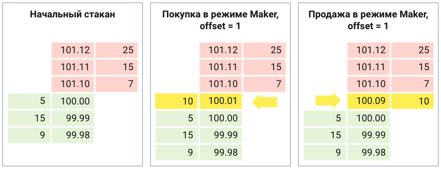

HFT Order Service позволяет трейдеру получить надежное и точное исполнение с выигрышем в цене по отношению к рыночной заявке, не отвлекаясь от разработки алгоритма на собственную разработку исполнения.

## Преимущества и возможности сервиса

1. Надежное исполнение: достаточно отправить в сервис заявку и получить ответ. Сервис на своей стороне обрабатывает разрывы связи и технические ошибки в процессе размещения ордеров, получения ответов и т.п., повторяя попытки исполнить заявки заданное количество раз.

2. Исполнение по лучшей, чем у рыночного ордера, цене: за счет настраиваемых сценариев котирования, HFT Order в среднем дает лучшую цену исполнения по сравнению с рыночной заявкой, гарантируя при этом исполнение всего объема. 

3. Исполнение по нескольким инструментам в рамках одной заявки:  можно указать несколько инструментов и по результатам исполнения всех инструментов придет один ответ. 


# Сценарии исполнения

Основа сценария исполнения - выставление лимитной заявки с заданным отступом от лучших цен (Best Ask, Best Bid) и перевыставление её через заданый интервал на оставшееся количество.

## Режимы исполнения

В алгоритме заложено две серии попыток. Для первой серии попыток задается режим исполнения. Первую сервию попыток можно использовать для получения лучшей цены. Для второй серии режим исполнения всегда Taker и она используется для гарантированного исполнения.  

### Режим Maker

Режим **Maker** предназначен для получения лучшей цены. В нем отступ задается от лучшей цены той же стороны, что и сторона сделки. Для покупки отступ задается от лучшей цены покупки (Best Bid) и заявка выставляется по цене Best Bid + offset. Для продажи - от лучшей цены продажи (best ask) по цене Best Ask - offset.

Если для режима maker для покупки задать отступ в один шаг цены, то заявка будет встанет в стакан перед лучшей ценой покупки и будет заполнена первой же рыночной заявкой на продажу.



### Режим Taker

Режим **Taker** предназначен для гарантированного исполнения заявки. В нем отступ задается от лучшей цены противоположной стороне сделки. Для покупки отступ задается от лучшей цены продажи и заявка выставляется по цене Best Ask + offset. Для продажи - от лучшей цены покупки по цене Best Bid - offset.

Если для режима taker для покупки задать отступ в один шаг цены, то заявка "бъет" в противоположную сторону стакана и сразу частично или целиком исполняется.


Отступ (Offset) может принимать отрицательные значения.

## Пример настроек сценария исполнения для получения лучшей цены

Сценарий пробует исполнить заявку по лучшей цене в течении 90 секунд и оставшееся количество исполняет "по рынку" с ограничением проскальзывания в 5 шагов цены от лучшей цены противополжной стороне сделки.

```
{
  "is_maker_in_first_stage": true, // Для первой серии попыток задан режим Maker
  "first_stage_price_shift_in_steps": 0, // Отступ от лучшей цены 0
  "first_stage_attempt_count": 30, // Количество перевыставлений в первой серии попыток
  // Вторая серия попыток
  "second_stage_price_shift_in_steps": 5, // Отступ 5 шагов цены для гарантированного исполнения
  "second_stage_attempt_count": 5, // Количество перевыставлений
  "time_limit_in_millis": 3000 // Интервал перевыставления в миллисекундах - 3 секунды
}
```

## Пример настроек сценария исполнения для быстрой сделки с ограничением проскальзывания

Сценарий пробует исполнить заявку по лучшей цене с противоположной стороны стакана с проскальзыванием 0 в течении 15 секунд и оставшееся количество исполняет "по рынку" с ограничением проскальзывания в 5 шагов цены от лучшей цены противополжной стороне сделки.

```
{
  "is_maker_in_first_stage": false, // Для первой серии попыток задан режим Taker
  "first_stage_price_shift_in_steps": 0, // Отступ от лучшей цены 0
  "first_stage_attempt_count": 5, // Количество перевыставлений в первой серии попыток 
  // Вторая серия попыток
  "second_stage_price_shift_in_steps": 5, // Отступ 5 шагов цены для гарантированного исполнения
  "second_stage_attempt_count": 5, // Количество перевыставлений
  "time_limit_in_millis": 3000 // Интервал перевыставления в миллисекундах - 3 секунды
}
```

# Ограничения MVP

В MVP не реализовано:
- Пользовательский и собственный id hft order
- Пользовательский комментарий
- Time_in_force параметр заявки (GTC, DAY)